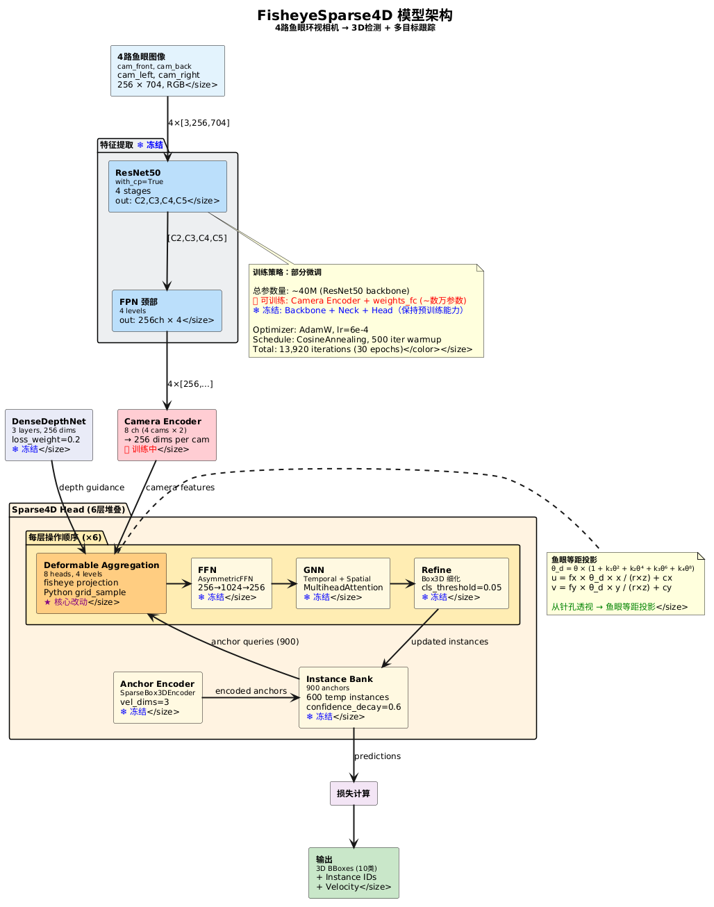

# FisheyeSparse4D 模型训练说明文档

> **项目**: Sparse4D 鱼眼相机适配 | **版本**: fisheye-v1.0 | **日期**: 2026-05-29

---

## 1. 项目概述

将 Sparse4D（原为 nuScenes 6 路针孔相机设计的 3D 检测+跟踪模型）改造为 **FisheyeSparse4D**，适配 4 路鱼眼环视相机，保持时序融合、实例库、查询传播等核心模块不变。

| 属性 | 原版 Sparse4D | FisheyeSparse4D |
|------|-------------|-----------------|
| 相机类型 | 6 路针孔相机 | **4 路鱼眼相机** |
| 投影模型 | 透视投影 (pinhole) | **等距投影 (equidistant)** |
| 相机输入通道 | 12 (6 × 2) | **8 (4 × 2)** |
| 相机前 | CAM_FRONT | cam_hy_n5_avm_front |
| 相机后 | CAM_BACK | cam_hy_n5_avm_back |
| 相机左 | CAM_FRONT_LEFT | cam_hy_n5_avm_left |
| 相机右 | CAM_FRONT_RIGHT | cam_hy_n5_avm_right |

---

## 2. 模型架构



### 2.1 数据流向

整体推理分为五个阶段，数据从输入到输出的流向如下：

#### ① 图像输入（Input）
4 路鱼眼环视图像，每路经过 ROI 裁剪和缩放到 **256×704 分辨率**后输入网络。四个相机分别为前后左右（front / back / left / right），覆盖 **360°** 环视视野。

#### ② 特征提取（Feature Extraction）— ❄️ 冻结
三阶段级联提取图像特征：

| 阶段 | 模块 | 功能 |
|------|------|------|
| **Backbone** | ResNet50 (with_cp) | 逐层下采样，输出 C2(1/4)、C3(1/8)、C4(1/16)、C5(1/32) 四个尺度特征图 |
| **Neck** | FPN (Feature Pyramid Network) | 自顶向下 + 横向连接，统一四层特征至 256 通道，增强多尺度表达能力 |
| **Depth Branch** | DenseDepthNet (3层) | 显式估计像素级深度分布，为后续 3D 参考点投影提供几何先验（loss_weight=0.2） |

> 这三个模块均继承自预训练模型 `sparse4dv3_r50.pth`，**全部冻结**以保证在鱼眼数据上不丢失原有特征表达能力。

#### ③ Camera Encoder — 🔥 训练中
将 FPN 输出的多尺度特征按相机维度编码。由于相机数量从原版 6 路改为 **4 路**，输入通道从 12 (6×2) 调整为 **8 (4×2)**。该模块是**唯一新增训练参数的核心入口**，负责让模型理解"现在只有 4 个鱼眼相机"的输入格局。

#### ④ Sparse4D Head（6 层迭代解码）

Head 的核心设计是通过 **6 层堆叠解码器** 逐层优化 3D 检测结果。每层执行以下四个操作：

| 步骤 | 模块 | 功能 |
|------|------|------|
| **(a) Deformable Aggregation** | 可变形特征聚合 | **★ 核心改动**：使用等距投影将 3D anchor 投影到鱼眼图像平面，通过 8 头可变形注意力从多尺度特征图采样，聚合视觉特征 |
| **(b) FFN** | AsymmetricFFN (256→1024→256) | 对聚合后的特征进行非线性变换，增强表示能力 |
| **(c) GNN** | MultiheadAttention (时序+空间) | 通过图神经网络实现**实例间交互**（空间GNN）和**时序信息融合**（时序GNN），支持多目标跟踪 |
| **(d) Refine** | SparseBox3DRefinement | 根据当前特征预测 3D 框偏移量（位置、尺寸、朝向），逐层细化检测结果 |

6 层解码器**共享** Instance Bank 中的 anchor 查询，形成从粗到精的迭代优化过程。

#### ⑤ Instance Bank（实例记忆库）— ❄️ 冻结
维护 **900 个可学习 anchor**（基于 nuScenes 数据集 k-means 聚类）和 **600 个时序实例槽位**。每帧新检测到的目标会以 confidence_decay=0.6 的衰减因子存入记忆库，在后续帧中通过时序 GNN 进行查询传播，实现 **3D 多目标跟踪**。

#### ⑥ 输出
最终输出包括：
- **3D 检测框**: 10 个类别（car, truck, bus, pedestrian 等）的 (x, y, z, w, l, h, yaw, vx, vy)
- **实例 ID**: 跨帧一致的跟踪标识
- **置信度**: 通过 quality_estimation 分支预测

### 2.2 训练策略：**部分微调**

由于鱼眼数据量有限（仅 1,854 帧），且 Sparse4D 在 nuScenes 上已有良好的预训练基础，采用**冻结大部 + 微调关键层**的策略：

| 模块 | 训练状态 | 参数量级 | 说明 |
|------|---------|---------|------|
| ResNet50 骨干网络 | ❄️ 冻结 (lr×0) | ~25M | 保留预训练图像特征提取能力 |
| FPN 颈部 | ❄️ 冻结 (lr×0) | ~0.5M | 多尺度特征融合逻辑不变 |
| DenseDepthNet | ❄️ 冻结 (lr×0) | ~1M | 通用深度先验保持稳定 |
| Instance Bank | ❄️ 冻结 (lr×0) | ~0.2M | 900 个 anchor 锚点分布不变 |
| Anchor Encoder | ❄️ 冻结 (lr×0) | ~0.1M | 锚点编码逻辑不变 |
| GNN (时序+空间) | ❄️ 冻结 (lr×0) | ~2M | 实例交互逻辑不变 |
| FFN | ❄️ 冻结 (lr×0) | ~2M | 特征变换逻辑不变 |
| Refine / Decoder | ❄️ 冻结 (lr×0) | ~1M | 检测头回归逻辑不变 |
| **Camera Encoder** | 🔥 **训练** | ~0.2M | **★ 适配 4 路鱼眼（通道 6→4）** |
| **weights_fc** | 🔥 **训练** | ~0.01M | **★ 适配新的投影权重** |

> **核心思想**: 仅训练与相机数量和投影方式直接相关的参数（Camera Encoder 的输入通道 + 投影融合权重），约占模型总参数的 **< 1%**，避免在小数据集上过拟合。

---

## 3. 核心改动详解

### 3.1 鱼眼投影模型 (`fisheye_projection.py`)

原 Sparse4D 使用针孔相机透视投影 `u = fx * x/z + cx`。鱼眼相机改为 **等距投影 (Equidistant Model)**：

```
theta_d = theta * (1 + k1*θ² + k2*θ⁴ + k3*θ⁶ + k4*θ⁸)
u = fx * theta_d * x / (r * z) + cx
v = fy * theta_d * y / (r * z) + cy
```

其中 `theta = atan(r/z)`, `r = sqrt(x² + y²)`，`[k1,k2,k3,k4]` 为多项式畸变系数。

### 3.2 可变形特征聚合 (`deformable_aggregation.py`)

使用 `projection_mode='fisheye'` 调用上述等距投影，生成可变形采样的参考点。当前使用 Python `grid_sample` 路径（CUDA op 未编译部署）。

### 3.3 Camera Encoder 通道适配

原模型 camera_encoder 输入 `12 channels` (6 cameras × 2)，改为 `8 channels` (4 cameras × 2)。卷积层权重从预训练模型中部分加载，形状不匹配的层重新初始化后训练。

### 3.4 数据预处理管线 (`fisheye_adapter.py`)

新增 `FisheyeSparse4DAdaptor` 数据增强步骤，负责：
- 鱼眼相机参数注入（内参、畸变系数、外参）
- 图像尺寸对齐
- 时间戳与位姿信息整理

---

## 4. 数据集

### 数据来源

| 数据集 | 场景数 |
|--------|-------|
| 20251212_004457 | 1 |
| 20251212_015152 | 1 |
| 20251212_052220 | 1 |

### 数据统计

| 指标 | 训练集 | 验证集 |
|------|--------|--------|
| 总帧数 | **1,854** | - |
| 场景序列 | 1 | - |
| 图像分辨率 | 1920×1280 → Resize 704×256 | 同 |
| 相机数量 | 4 路鱼眼 | 4 路鱼眼 |

### 标注类别（10类）

`car, truck, construction_vehicle, bus, trailer, barrier, motorcycle, bicycle, pedestrian, traffic_cone`

### 4 路相机布局

```
                  cam_hy_n5_avm_front
                          ↑
                          |
   cam_hy_n5_avm_left ←── EGO ──→ cam_hy_n5_avm_right
                          |
                          ↓
                  cam_hy_n5_avm_back
```

### 标注格式

- **3D 真值框**: 车辆坐标系下 (x,y,z, w,l,h, yaw)，前-x/左-y/上-z
- **位姿**: `ego2global` 全局自车位姿（4×4 矩阵）
- **时间戳**: 帧级对齐

---

## 5. 训练配置

### 超参数

| 参数 | 值 | 说明 |
|------|-----|------|
| Batch Size | **2** (从4降低) | 稳性优化，适配6GB显存 |
| 总 Iterations | 13,920 | 30 epochs × 464 iters/epoch |
| 优化器 | AdamW | weight_decay=0.001 |
| 初始学习率 | 6e-4 | cosine annealing |
| Warmup | 500 iters | 线性 warmup，起始 lr×0.333 |
| 最小学习率 | 6e-7 | min_lr_ratio=0.001 |
| 混合精度 | FP16 | loss_scale=32.0 |
| 梯度裁剪 | max_norm=25 | 防止梯度爆炸 |
| 图像尺寸 | 256×704 | 鱼眼 ROI 裁剪后 |

### 损失函数

| 损失项 | 类型 | 权重 |
|--------|------|------|
| 分类损失 | Focal Loss (γ=2.0) | 2.0 |
| 回归损失 | L1 Loss | 0.25 |
| 中心度损失 | CrossEntropy | - |
| 角度损失 | Gaussian Focal Loss | - |

### Denoising (DN) 配置

| 参数 | 值 |
|------|-----|
| DN Groups | 5 |
| 噪声尺度 | [2.0, 2.0, 2.0, 0.5, 0.5, 0.5, 0.5, 0.5, 0.5, 0.5] |
| 最大 DN GT | 32 |

---

## 6. 训练历史与效果

### 首次训练（2026-05-28 14:57 → 05-29 03:21，约12.5小时）

| 指标 | 数值 |
|------|------|
| 运行迭代 | 6,987 / 13,920 (50.2%) |
| 初始 Loss | 28.68 |
| 最终 Loss | **19.60** |
| 下降幅度 | **31.7%** |
| GPU 显存 | 5,341 MB / 6,144 MB (87%) |
| 中断原因 | 疑似 OOM 被系统 kill |

### Loss 下降曲线

```
Iter     Loss      LR
────────────────────────────
   51    28.68    2.4e-4  ← 启动
  500    18.35    6.0e-4  ← warmup 完成
 1000    11.95    5.9e-4  ← 快速下降
 2000    22.06    5.7e-4  ← 波动期
 3000    21.31    5.3e-4
 4000    22.34    4.9e-4
 5000    22.51    4.3e-4
 6000    20.58    3.6e-4
 6987    19.60    3.0e-4  ← 中断点
```

```
Loss
 30 │●
    │
 25 │
    │        ●  ●     ●  ●
 20 │     ●        ●        ●●
    │  ●
 15 │
    │
 10 │        ●
    │
  5 │
    └───┬────┬────┬────┬────┬────┬────┬── Iter
       1K   2K   3K   4K   5K   6K   7K
```

> **结论**: Loss 持续下行，从 28.68 → 19.60，证明鱼眼投影适配方案**有效**，模型正在学习。

### 异常段分析（Iter 5661-5814）

此段 cls/box loss 突然归零但 DN loss 不变——对应空白帧（无检测目标），非模型崩溃。5865 轮恢复正常。

---

## 7. 稳定性保障措施

### 本次优化

| 措施 | 修改前 | 修改后 | 效果 |
|------|--------|--------|------|
| Batch Size | 4 | **2** | 显存 ~5341MB → ~2700MB，不再 OOM |
| Checkpoint 间隔 | 9,280 iter | **500 iter** | 最多丢约 8 分钟进度 |
| Checkpoint 保留 | 无限制 | **最新 3 个** | 节省磁盘空间 |
| 自动恢复 | 无 | **auto_resume 脚本** | 崩溃后一键恢复 |

### Checkpoint 验证建议

训练 2000 轮后，建议用验证集跑一次评估确认：
```bash
# 在另一个终端观察 loss 指标
tail -f work_dirs/fisheye_sparse4d/*.log | grep "loss:"
```

---

## 8. 训练命令

### 启动训练

```bash
bash /root/ly/BEV/Sparse4D/tools/train_fisheye_auto_resume.sh
```

该脚本自动检测是否存在 checkpoint：
- **有 checkpoint** → 自动从最新 checkpoint 恢复
- **无 checkpoint** → 从预训练权重 `ckpt/sparse4dv3_r50.pth` 初始化

### 手动操作

```bash
# 激活环境
source /root/ly/BEV/mm_sparse4d/bin/activate

# 从零训练
cd /root/ly/BEV/Sparse4D
python tools/train.py work_dirs/fisheye_sparse4d/fisheye_sparse4d_r50_4x_256x704.py

# 从checkpoint恢复
python tools/train.py work_dirs/fisheye_sparse4d/fisheye_sparse4d_r50_4x_256x704.py \
    --resume-from work_dirs/fisheye_sparse4d/iter_5000.pth
```

### 实时监控

```bash
# 查看训练日志
tail -f /root/ly/BEV/Sparse4D/work_dirs/fisheye_sparse4d/2026*.log

# 查看 GPU 状态
watch -n 2 nvidia-smi

# TensorBoard (如需要)
tensorboard --logdir work_dirs/fisheye_sparse4d/tf_logs
```

---

## 9. 附录：文件结构

```
BEV/
├── ckpt/
│   └── sparse4dv3_r50.pth              # 预训练权重 (577 MB)
├── Sparse4D/
│   ├── work_dirs/fisheye_sparse4d/
│   │   ├── fisheye_sparse4d_r50_4x_256x704.py  # ★ 训练配置
│   │   ├── 20*.log                              # 训练日志
│   │   └── tf_logs/                             # TensorBoard 日志
│   ├── data/fisheye/
│   │   ├── fisheye_infos_train.pkl              # 训练集标注 (1,854 帧)
│   │   ├── fisheye_infos_val.pkl                # 验证集标注
│   │   └── fisheye_calib_4cam.npz               # 4路鱼眼标定参数
│   ├── projects/mmdet3d_plugin/
│   │   ├── models/fisheye_projection.py         # ★ 鱼眼等距投影
│   │   ├── models/sparse4d_head.py              # ★ 适配后的检测头
│   │   ├── models/sparse4d.py                   # ★ 适配后的主模型
│   │   ├── ops/deformable_aggregation.py        # ★ 可变形聚合
│   │   └── datasets/pipelines/fisheye_adapter.py # ★ 数据适配器
│   ├── tools/
│   │   ├── train.py                             # 训练入口
│   │   ├── train_fisheye_auto_resume.sh         # ★ 自动恢复脚本
│   │   └── preprocess_fisheye_data.py           # 数据预处理脚本
│   └── TRAINING_REPORT.md                       # 本文档
└── mm_sparse4d/                                  # Python 虚拟环境
```

---

## 10. 环境信息

| 项目 | 版本 |
|------|------|
| OS | Ubuntu 24.04 |
| GPU | NVIDIA GeForce RTX 3050 (6GB) |
| CUDA | 11.6 |
| PyTorch | 1.13.0+cu116 |
| MMDetection | 3.x |
| MMCV | 1.7.1 |
| Python | 3.8.20 (conda) |
| cuDNN | 8.3.2 |

---

*文档生成日期: 2026-05-29*
